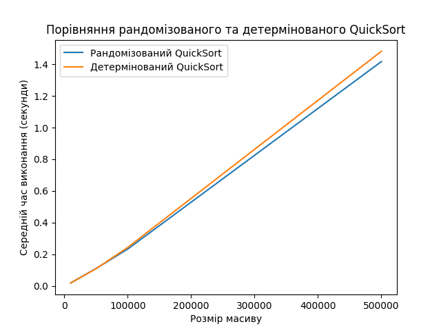
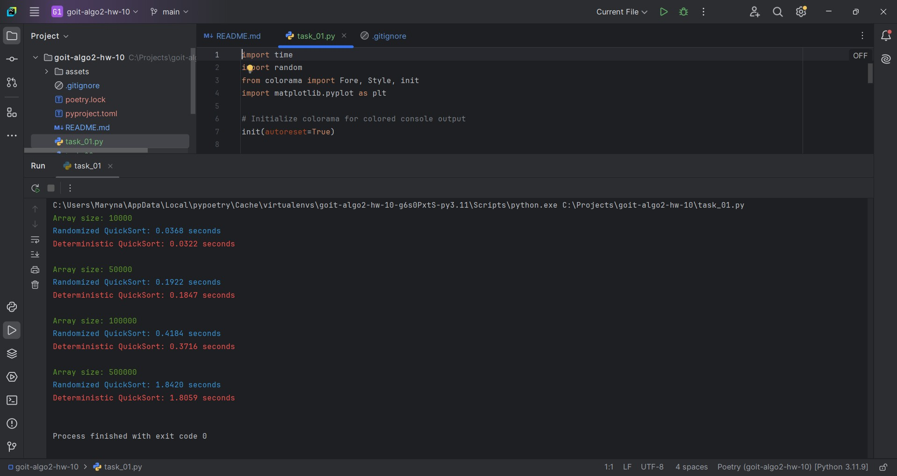
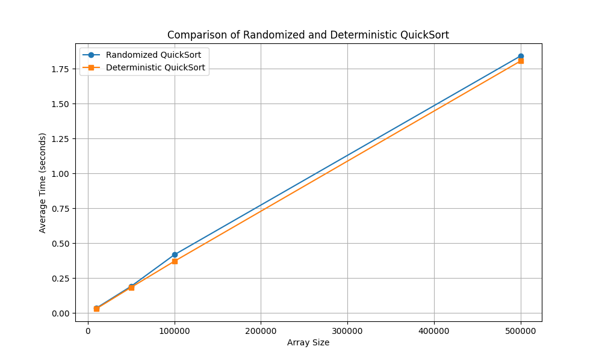
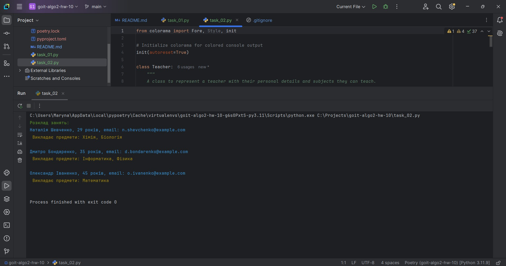

# HW-10 | Algorithmic Complexity, Approximate and Randomized Algorithms

## Hello! 👋🏻 Ready for a new challenge?

This homework consists of two independent tasks.

In the first task, you will learn to implement different variations of the QuickSort algorithm, conduct empirical research on their efficiency, and visualize the results. By working with large datasets, you will deepen your understanding of how the choice of pivot affects sorting performance and the differences between deterministic and randomized approaches.

This practical experience will enhance your critical thinking skills and ability to conduct experimental research in algorithm studies.

In the second task, you will learn to implement a greedy algorithm for solving a real-world optimization problem—scheduling classes. This task will help you understand how to use a greedy approach to minimize resources (in this case, the number of teachers) while achieving the desired goal (covering all subjects).

You will also learn to work with selection criteria by implementing priority logic, preparing you to apply such methods in real projects.

This experience will give you a better understanding of greedy algorithms and their applications in solving practical optimization problems.

Let's get started! 🚵🏻‍♀️

---

## Task 1: Comparison of Randomized and Deterministic QuickSort

Implement both randomized and deterministic versions of the QuickSort algorithm. Conduct a comparative analysis of their efficiency by measuring the average execution time on arrays of different sizes.

### Technical Requirements

1. To implement the randomized QuickSort algorithm, create the function `randomized_quick_sort(arr)`, where the pivot element is chosen randomly.

2. To implement the deterministic QuickSort algorithm, create the function `deterministic_quick_sort(arr)`, where the pivot element is selected based on a fixed rule: the first, last, or middle element.

3. Create a set of test arrays with different sizes: 10,000, 50,000, 100,000, and 500,000 elements. Fill the arrays with random integers.

4. Measure the execution time of both algorithms on each array. To obtain more accurate results, repeat the sorting for each array 5 times and calculate the average execution time.

### Acceptance Criteria

📌 The acceptance criteria for the homework are mandatory for review by the mentor. If any criteria are not met, the mentor will return the assignment for revision without evaluation. If you need "just a clarification" 😉 or if you are "stuck" on any stage of the task, feel free to reach out to the mentor on Slack.

1. The functions `randomized_quick_sort` and `deterministic_quick_sort` implement sorting algorithms and correctly sort arrays (20 points).

2. Execution time for the algorithms is measured and presented in a table and graph (10 points).

3. Graphs are constructed with labeled axes and a legend (5 points).

4. An analysis of the results is conducted, and conclusions are drawn regarding the efficiency of randomized and deterministic QuickSort (10 points).

5. The code includes an example of use and produces expected results (5 points).

### Example of Graph Construction by the Program



### Example of Terminal Output

```
Array size: 10000
   Randomized QuickSort: 0.0189 seconds
   Deterministic QuickSort: 0.0189 seconds

Array size: 50000
   Randomized QuickSort: 0.1104 seconds
   Deterministic QuickSort: 0.1090 seconds

Array size: 100000
   Randomized QuickSort: 0.2333 seconds
   Deterministic QuickSort: 0.2435 seconds

Array size: 500000
   Randomized QuickSort: 1.4166 seconds
   Deterministic QuickSort: 1.4815 seconds
```

---

## Task 2: Scheduling Classes Using a Greedy Algorithm

Implement a program to create a university class schedule using a greedy algorithm for the set cover problem. The goal is to assign teachers to subjects in such a way that minimizes the number of teachers while covering all subjects.

### Technical Requirements

Given a set of subjects: `{'Mathematics', 'Physics', 'Chemistry', 'Computer Science', 'Biology'}`

List of teachers:

1. Oleksandr Ivanenko, 45 years old, o.ivanenko@example.com, subjects: `{'Mathematics', 'Physics'}`
2. Mariya Petrenko, 38 years old, m.petrenko@example.com, subjects: `{'Chemistry'}`
3. Serhiy Kovalenko, 50 years old, s.kovalenko@example.com, subjects: `{'Computer Science', 'Mathematics'}`
4. Nataliya Shevchenko, 29 years old, n.shevchenko@example.com, subjects: `{'Biology', 'Chemistry'}`
5. Dmytro Bondarenko, 35 years old, d.bondarenko@example.com, subjects: `{'Physics', 'Computer Science'}`
6. Olena Grytsenko, 42 years old, o.grytsenko@example.com, subjects: `{'Biology'}`

### Task Description

Implement the `Teacher` class with the following attributes:
- `first_name` (first name)
- `last_name` (last name)
- `age` (age)
- `email` (email address)
- `can_teach_subjects` (set of subjects they can teach)

Implement the function `create_schedule(subjects, teachers)`, which uses a greedy algorithm to assign teachers to subjects. The function should return a list of teachers along with their assigned subjects.

When selecting a teacher at each step, prioritize the one who can teach the most uncovered subjects. If multiple candidates meet this criterion, choose the youngest one.

### Acceptance Criteria

1. The program covers all subjects in the given set of subjects (20 points).

2. If it is impossible to cover all subjects with the available teachers, the program should output a message indicating this (15 points).

3. All subjects must be covered by teachers, and all teachers should be assigned their respective subjects (15 points).

### Program Template

```python
# Definition of the Teacher class
class Teacher:
    pass

def create_schedule(subjects, teachers):
   pass

if __name__ == '__main__':
    # Set of subjects
    subjects = {}
    # Creating a list of teachers
    teachers = []

    # Calling the schedule creation function
    schedule = create_schedule(subjects, teachers)

    # Displaying the schedule
    if schedule:
        print("Class Schedule:")
        for teacher in schedule:
            print(f"{teacher.first_name} {teacher.last_name}, {teacher.age} years old, email: {teacher.email}")
            print(f"   Teaches subjects: {', '.join(teacher.assigned_subjects)}\n")
    else:
        print("It is impossible to cover all subjects with the available teachers.")
```

---

# RESULTS

### Task 1





### Task 2

